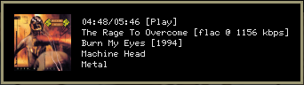

## musinfo

A program written in pure Rust to query music info from `mpd` and display it in a notification.

Note: Cover art is expected to be placed at `/tmp/cover.png`.

## Output

```
elapsed/duration
title [state]
album (date)
artist
genre
```

Example:

